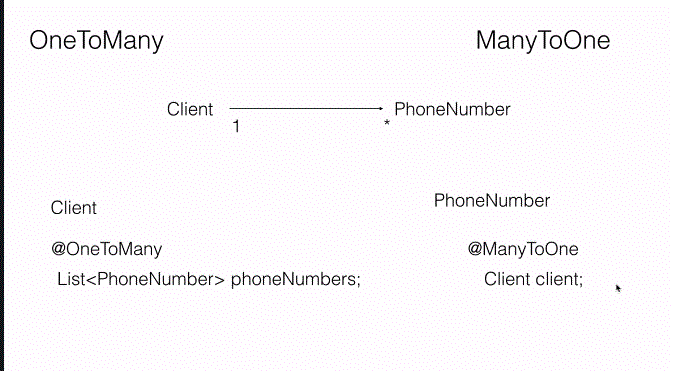

# Association Mapping
## ONE-TO-MANY

### Steps
1. Create Project with following starters 
     - DATA JPA  
     - H2  
     - LOMBOK  
     - Spring Web  
     
  2. Add schema.sql file in resource folder  
      create table customer(id int PRIMARY KEY AUTO_INCREMENT,name varchar(20));  
      create table phone_number(id int PRIMARY KEY AUTO_INCREMENT,customer_id int,number varchar(20),type varchar(20), FOREIGN KEY (customer_id) REFERENCES customer(id) );  
      
  3. Configure H2 Database in application.properties  
      **H2 Database**   
      **MODE=MySQL** USED TO RUN H2 in MYSQL mode   
      spring.datasource.url=jdbc:h2:mem:testdb;MODE=MySQL;  
      spring.datasource.driverClassName=org.h2.Driver  
      spring.datasource.username=sa  
      spring.datasource.password=  
      spring.jpa.database-platform=org.hibernate.dialect.H2Dialect  
      spring.jpa.show-sql=true  
      spring.h2.console.enabled=true  

      
      After config , start application and try access H2 console(port will change based on your configuration)
      http://localhost:8080/h2-console use spring.datasource.url as jdbc url in console
      
  4. Create Product Entity  
      *define all colums as properties  
      *annotate primary column with @ID  
      
  5. Create ProductRepo interfacce by extending CrudRepository interface  
     CrudRepository provided basic crud functionalities and internally extends Repository
     
  6. Service Layer or Controller Layer  
     Auto wire ProductRepo 
     implement Create,Read,update,delete by calling methods in ProductRepo  
     *Technically ProductRepo does not contain any mathod, CRUD methods are extended from CRUD REPO
